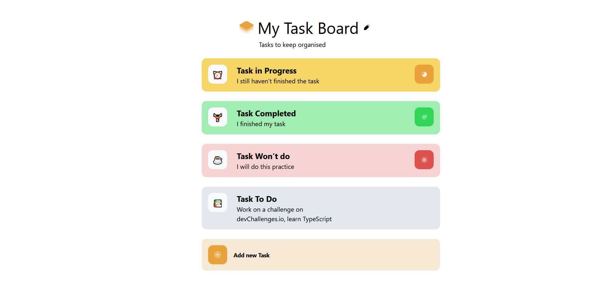

# devchallenges.io - My Task Board

Esta es una solución al [My Task Board] (https://devchallenges.io/challenge/my-task-board-app). 

## Descripción general

### El reto

En este desafío completo, desarrollarás una aplicación de gestión de tareas sencilla, que implicará la implementación de métodos CRUD. Este proyecto ofrecerá la oportunidad de demostrar su competencia en el desarrollo completo mediante la creación de un sistema que permita a los usuarios gestionar las tareas.

### Screenshot

### Links

- URL del sitio activo: https://mytaskboardejcp.netlify.app

## Mi proceso

### Construido con

- React 
    - React-icons
    - Sonner
    - uuid
- Tailwindcss
- vite
